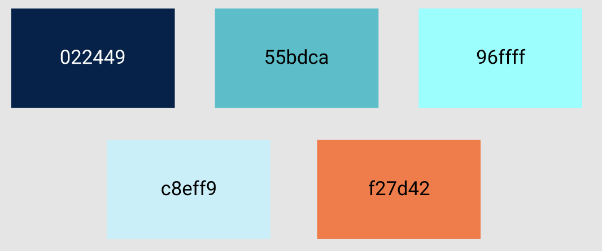

# expense-tracker-html-css-js

## About 
This application is to demonstrate working knowledge of the single page web application. This application uses the following resources:
1. AirTable: This is the database for the application.
2. HTML5: This is the text of the web application.
3. CSS: This is the stylesheet of the application.
4. Javascript: This is the logical framework of the application.

## Design
1. The application will have a layout showing the account that the user is in and the ammount of funds available in the account.
2. The application will have a list of expenses and deposits.
3. The application will have the ability to add, edit, and delete entries.

## Wireframe

## Color Scheme
